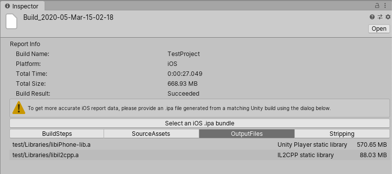

Build Report Inspector for Unity
================================

This package contains an Editor script which implements an inspector for BuildReport files.
The BuildReport class lets you access information about your last build, and helps you profile the time spent building your project and the builds disk size footprint. This information may help you improving your build times and build sizes.  
This script allows you to inspect this information graphically in the Editor UI, making it more easily accessible than the script APIs would.  

The BuildReport file is generated for Player builds ( [BuildPipeline.BuildPlayer](https://docs.unity3d.com/ScriptReference/BuildPipeline.BuildPlayer.html)), as well as [BuildPipeline.BuildAssetBundles](https://docs.unity3d.com/ScriptReference/BuildPipeline.BuildPlayer.html). 

The Addressables and Scriptable Build Pipeline packages do not generate a BuildReport file, but Addressables has its own UI for showing build results.

Disclaimer
==========

**This package is provided as-is, with no support from Unity Technologies.** 

It serves as a demonstration of the information available in the BuildReport file.  It can be a useful tool "as-is" and continues to be functional in recent versions of Unity, for example Unity 6.

Another way to view the build report is using the [Project Auditor package](https://docs.unity3d.com/Packages/com.unity.project-auditor@1.0/manual/build-view-reference.html).

And you can also write your own custom script to access data about your builds, using the [BuildReport](https://docs.unity3d.com/ScriptReference/Build.Reporting.BuildReport.html) scripting API

Usage
=====

Clone this [repository](git@github.com:Unity-Technologies/BuildReportInspector.git). Or download it as a zip file and expand it to a location on your local hard drive.

In the Unity Package Manager Window select "Add package from disk" and select the `package.json` file inside the `com.unity.build-report-inspector` folder in your copy of this project.

Once added the custom view will appear any time you use the Inspector to view a BuildReport file.

Unity will write the BuildReport to `Library/LastBuild.buildreport` when making a build.  This location is cannot be reached from the Project view, but the file can manually be copied somewhere inside the Assets folder to view it.

This package adds a menu item `Window/Open Last Build Report` which will take care of copying the last build report file to the Assets/BuildReports folder and select it so that it can be viewed in the Inspector.  The file will be renamed to include a time stamp so that you can have multiple build reports in the same folder.

Note: By default the `Library/LastBuild.buildreport` file is in binary serialization format.  But when copied into the Assets folder it will be converted to yaml text format (provided the Asset Serialization project setting is set to "Text").

The Inspector Window includes have several tabs, which are described in the following sections:

### Build steps
The different steps involved in making you build, how long they took, and what messages were printed during those steps (if any).  

The equivalent information is exposed through the API by [BuildReport.steps](https://docs.unity3d.com/ScriptReference/Build.Reporting.BuildReport-steps.html).

Note: when [BuildOptions.DetailedBuildReport](https://docs.unity3d.com/ScriptReference/BuildOptions.DetailedBuildReport.html) is used then the build steps will include much more information. The amount of build step data generated by this flag is not appropriate for large builds, but can be useful when diagnosing issues with smaller player builds.

### Source assets
A list of all assets which are used in the build, and how much they contribute to your build size  

For the API equivalent see [PackedAssets](https://docs.unity3d.com/6000.1/Documentation/ScriptReference/Build.Reporting.PackedAssets.html).

Warning: This view aggregates information about every single object in the build.  Currently this view is so slow that it is unusable for large builds (e.g. large numbers of Assets or prefabs with large GameObject hierarchies).

### Output files
A list of all files written by the build  

For the API equivalent see [BuildReport.GetFiles](https://docs.unity3d.com/ScriptReference/Build.Reporting.BuildReport.GetFiles.html).

### Stripping
For platforms which support engine code stripping, a list of all engine modules added to the build, and what caused them to be included in the build.  

For the API equivalent see [StrippingInfo](https://docs.unity3d.com/ScriptReference/Build.Reporting.StrippingInfo.html).

### Scenes using Assets
[Available from Unity 2020.1.0a6]

This tab is only populated when you use the [BuildOptions.DetailedBuildReport](https://docs.unity3d.com/ScriptReference/BuildOptions.DetailedBuildReport.html) build option when calling [BuildPipeline.BuildPlayer](https://docs.unity3d.com/ScriptReference/BuildPipeline.BuildPlayer.html) in a custom build script.

This shows a list describing which scenes are using each asset of the build.

For the API equivalent see [ScenesUsingAssets](https://docs.unity3d.com/ScriptReference/Build.Reporting.ScenesUsingAssets.html).

### Mobile
[Available from Unity 2019.3]  
The BuildReport API is not very good at reporting data from mobile builds. For this reason, starting at Unity 2019.3, mobile appendix was added to the BuildReportInspector. The mobile appendix expands the BuildReportInspector UI by adding mobile-specific entries, such as architectures inside the build, app store download sizes and the list of files inside the application bundle (.apk, .obb, .aab for Android and .ipa for iOS/tvOS).

#### Android
The mobile appendix is generated automatically for Android builds, right after Unity exports the application bundle.  

#### iOS
Because Unity does not export .ipa bundles directly, they need to be generated manually by the user. When an iOS build report is opened in Unity, the BuildReportInspector UI will display a prompt to open an .ipa bundle for more detailed information about the build, as shown in the image below.

To generate a development .ipa bundle:

1. Open the Xcode project exported by Unity.
2. In the menu bar, go to `Product > Archive`.
3. Once Xcode finishes archiving, click `Distribute App`.
4. Select `Development` distribution method, go to next step.
5. Select desired App Thinning and Bitcode options, go to next step.
6. Set valid signing credentials and click `Next`.
7. Once Xcode finishes distributing, click `Export` and select where to save the distributed files.

Once these steps are complete, an .ipa bundle will be inside the directory, saved in step 7.  
This process can also be automated using the `xcodebuild` command line tool.  
After the .ipa bundle is provided, the iOS-specific information is added to the BuildReportInspector UI automatically.
