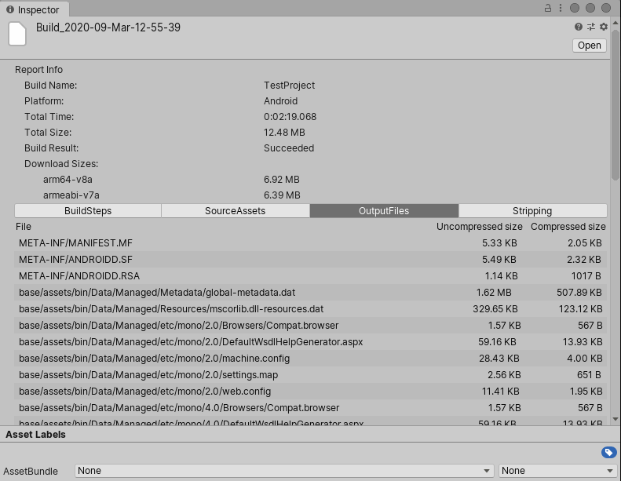
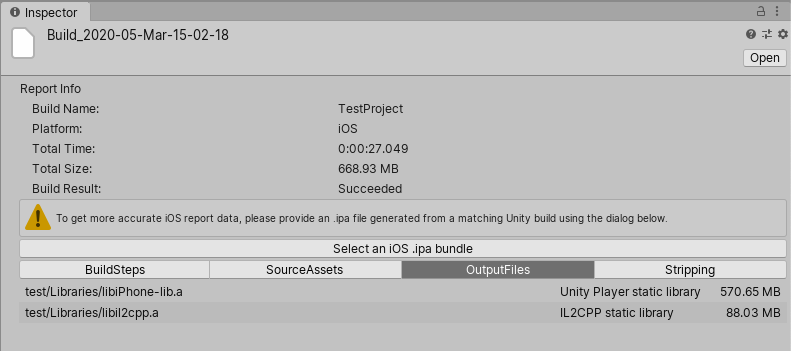

# About Build Report Inspector

This package contains an Editor script which implements an inspector for BuildReport files.

The BuildReport file is generated for Player builds ( [BuildPipeline.BuildPlayer](https://docs.unity3d.com/ScriptReference/BuildPipeline.BuildPlayer.html)), as well as [BuildPipeline.BuildAssetBundles](https://docs.unity3d.com/ScriptReference/BuildPipeline.BuildPlayer.html). 

This file records information about your last build, and helps you profile the time spent building your project and to understand the disk size footprint of the build output.

This package adds UI support for inspecting this information graphically in the Unity Editor Inspector view.

Note: The Addressables and Scriptable Build Pipeline packages do not generate a BuildReport file, but Addressables has its own "Addressables Report" UI for showing build results.

## Alternatives to using this package

* The [Project Auditor package](https://docs.unity3d.com/Packages/com.unity.project-auditor@1.0/manual/build-view-reference.html) supports viewing the Build Report for the most recent Player Build.

* [UnityDataTools](https://github.com/Unity-Technologies/UnityDataTools/blob/main/Documentation/buildreport.md) supports importing a BuildReport into an sqlite database. This is recommended for looking at the information from very large builds.

* You can also write your own custom script to access data about your builds, using the [BuildReport](https://docs.unity3d.com/ScriptReference/Build.Reporting.BuildReport.html) scripting API

* There are some widely used tools on the [Asset Store](https://assetstore.unity.com/).

## Preview package
This package is available as a preview.

**This package is provided as-is, with no support from Unity Technologies.** 

It serves as a demonstration of the information available in the BuildReport file.  It can be a useful tool "as-is" and continues to be functional in recent versions of Unity, for example Unity 6.

## Package contents

The following table describes the package folder structure:

|**Location**|**Description**|
|---|---|
|*Editor*|Contains the package scripts.|

## Installation

To install this package, follow the instructions in the [Package Manager documentation](https://docs.unity3d.com/Manual/upm-ui-install.html).

A recommended way is to install the package from github:

Clone this [repository](git@github.com:Unity-Technologies/BuildReportInspector.git). Alternatively download it as a zip file and expand it to a location on your local hard drive.  Typically it is best to use the "main" branch which has the latest recommended version.

In the Unity Package Manager Window select "Add package from disk" and select the `package.json` file inside the `com.unity.build-report-inspector` folder in your copy of this project.

Once the package is added the custom view will appear any time you use the Inspector to view a BuildReport file.
  
This script adds a convenient menu shortcut (_Window/Open Last Build Report_), to copy that file to the **Assets** folder and select it, so you can inspect it using the Build Report Inspector.

## Requirements

This version of Build Report Inspector is compatible with the following versions of the Unity Editor:

* 2021.3 and later.  It may also be functional in 2019 and 2020 versions.

---

# Using Build Report Inspector

Unity will write the BuildReport to `Library/LastBuild.buildreport` when making a build.  This location is cannot be reached from the Project view, but the file can manually be copied somewhere inside the Assets folder to view it.

This package adds a menu item `Window/Open Last Build Report` which will take care of copying the last build report file to the Assets/BuildReports folder and select it so that it can be viewed in the Inspector.  The file will be renamed to include a time stamp so that you can have multiple build reports in the same folder.

Note: By default the `Library/LastBuild.buildreport` file is in binary serialization format.  But when copied into the Assets folder it will be converted to yaml text format (provided the Asset Serialization project setting is set to "Text").

The Inspector Window includes several tabs:

| Tab | Description |
|-----|-------------|
| [Build Steps](./tab-build-steps.md) | The different steps involved in making your build, how long they took, and what messages were printed during those steps. |
| [Content Summary](./tab-content-summary.md) | A summary of the content of the build, including overall statistics and sizes aggregated by Type and Source Asset. |
| [Source Assets](./tab-source-assets.md) | Detailed information about the objects and resources and how they contribute to the build size.  This also supports exporting to csv, see [Exporting and Analysis](./exporting-and-analysis.md) for more details. |
| [Output Files](./tab-output-files.md) | A list of all files written by the build. |
| [Duplicated Assets](./tab-duplicated-assets.md) | Reports duplicated assets in AssetBundle builds (AssetBundle builds only). |
| [Stripping](./tab-stripping.md) | A list of all engine modules added to the build and what caused them to be included (Player builds only). |
| [Scenes Using Assets](./tab-scenes-using-assets.md) | Shows which scenes are using each asset (requires BuildOptions.DetailedBuildReport). |

### Mobile

The mobile appendix was introduced, starting with Unity 2019.3, to report additional data for mobile builds.  

When present, the BuildReportInspector UI includes additional mobile-specific entries, such as architectures inside the build, App Store download sizes and the list of files inside the application bundle (.apk, .obb, .aab for Android and .ipa for iOS/tvOS). 

#### Android
The mobile appendix is generated automatically for Android builds using build callbacks, immediately after Unity exports the application bundle.

This appendix information is saved in a file in the "Assets/BuildReports/Mobile" directory named after the build's unique GUID.

#### iOS
Because Unity does not export .ipa bundles directly, they need to be generated manually by the user. When an iOS build report is opened in Unity, the BuildReportInspector UI will display a prompt to open an .ipa bundle for more detailed information about the build, as shown in the image below.

To generate a development .ipa bundle:

1. Open the Xcode project exported by Unity.
2. In the menu bar, go to `Product > Archive`.
3. Once Xcode finishes archiving, click `Distribute App`.
4. Select `Development` distribution method, go to next step.
5. Select desired App Thinning and Bitcode options, go to next step.
6. Set valid signing credentials and click `Next`.
7. Once Xcode finishes distributing, click `Export` and select where to save the distributed files.

Once these steps are complete, an .ipa bundle will be inside the directory, saved in step 7.  
This process can also be automated using the `xcodebuild` command line tool.  
After the .ipa bundle is provided, the iOS-specific information is added to the BuildReportInspector UI automatically.

---

# Contributing

The source for Build Report Inspector package is available at https://github.com/Unity-Technologies/BuildReportInspector  
For contributions, please refer to the repository's [CONTRIBUTING.md](https://github.com/Unity-Technologies/BuildReportInspector/blob/master/com.unity.build-report-inspector/CONTRIBUTING.md) file.
