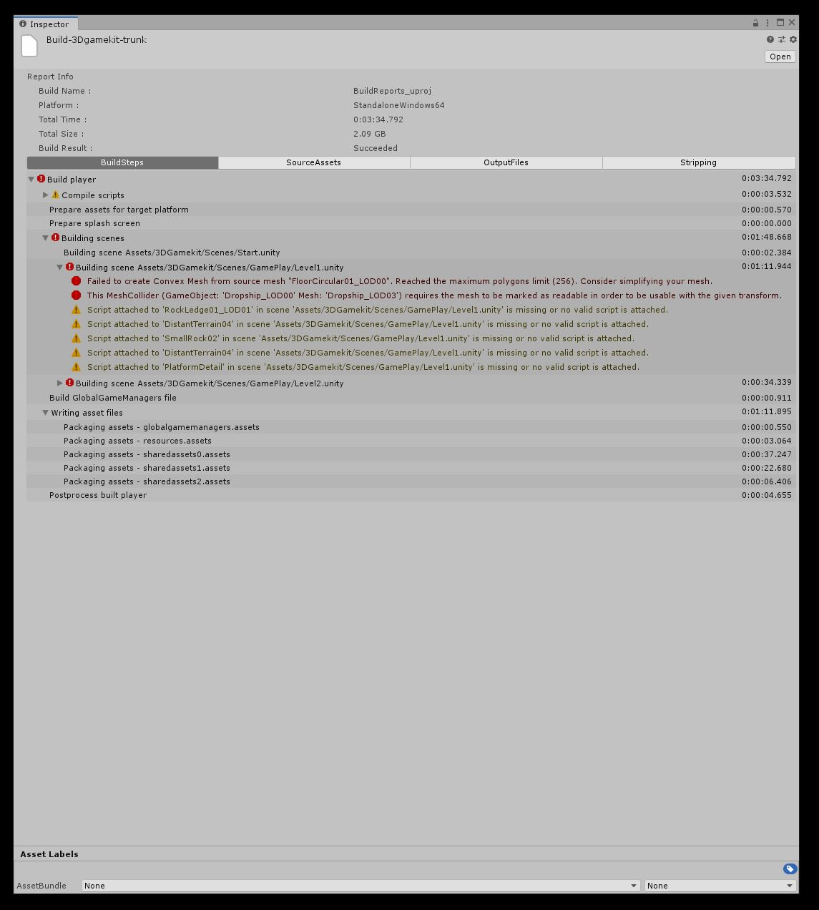
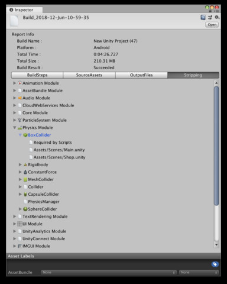
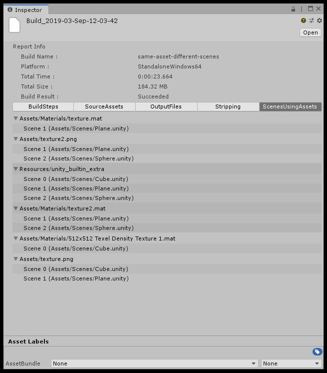

# About Build Report Inspector

Build Report Inspector is an Editor script which implements an inspector for the BuildReport class added in Unity 18.1.  
The BuildReport class lets you access information about your last build, and helps you profile the time spent building your project and the builds disk size footprint. This information may help you improving your build times and build sizes.  
This script allows you to inspect this information graphically in the Editor UI, making it more easily accessible than the script APIs would.

## Preview package
This package is available as a preview, so it is not ready for production use. The features and documentation in this package might change before it is verified for release.

We plan to add a built-in and supported UI for the BuildReport feature in a future version of Unity, but until then, this package serves as a demonstration on how you can access the BuildReport information today.

In particular, this package gets the information it can from the BuildReport Scripting API (https://docs.unity3d.com/ScriptReference/Build.Reporting.BuildReport.html), but some information in the BuildReport object is not yet exposed through public APIs.  

## Package contents

The following table describes the package folder structure:

|**Location**|**Description**|
|---|---|
|*Editor*|Contains the package scripts.|

## Installation

To install this package, follow the instructions in the [Package Manager documentation](https://docs.unity3d.com/Manual/upm-ui-install.html).

You can obtain a BuildReport object as the return value of the BuildPlayer API (https://docs.unity3d.com/ScriptReference/BuildPipeline.BuildPlayer.html) when making a build, or by selecting a file containing BuildReport data.  
Unity's default build setup will write such a file to **Library/LastBuild.buildreport** (this may change in the future) when making a build.  
This script adds a convenient menu shortcut (_Window/Open Last Build Report_), to copy that file to the **Assets** folder and select it, so you can inspect it using the Build Report Inspector.

Once open in the inspector, you can chose what data to view using the popup menu at the top of the window. The Build Report Inspector can show the following data:

## Requirements

This version of Build Report Inspector is compatible with the following versions of the Unity Editor:

* 2018.1 and later (recommended)

---

# Using Build Report Inspector

In UnityEditor, select a BuildReport object created after a project build.

You can obtain a BuildReport object as the return value of the BuildPlayer API (https://docs.unity3d.com/ScriptReference/BuildPipeline.BuildPlayer.html) when making a build, or by selecting a file containing BuildReport data.  
Unity's default build setup will write such a file to **Library/LastBuild.buildreport** (this may change in the future) when making a build.  
This script adds a convenient menu shortcut (_Window/Open Last Build Report_), to copy that file to the **Assets** folder and select it, so you can inspect it using the Build Report Inspector.

Once open in the inspector, you can chose what data to view using the popup menu at the top of the window. The Build Report Inspector can show the following data:

### Build steps
The different steps involved in making you build, how long they took, and what messages were printed during those steps (if any).  

### Source assets
A list of all assets which are used in the build, and how much they contribute to your build size  

### Output files
A list of all files written by the build  

### Stripping
For platforms which support engine code stripping, a list of all engine modules added to the build, and what caused them to be included in the build.  

### Scenes using Assets
[Available from Unity 2020.1.0a6]  
When BuildOptions.DetailedBuildReport is passed to [BuildPipeline.BuildPlayer](https://docs.unity3d.com/ScriptReference/BuildPipeline.BuildPlayer.html), a list describing which scenes are using each asset of the build, is provided in the BuildReport.

### Mobile
[Available from Unity 2019.3]  
The BuildReport API is not very good at reporting data from mobile builds. For this reason, starting at Unity 2019.3, mobile appendix was added to the BuildReportInspector. The mobile appendix expands the BuildReportInspector UI by adding mobile-specific entries, such as architectures inside the build, app store download sizes and the list of files inside the application bundle (.apk, .obb, .aab for Android and .ipa for iOS/tvOS).

#### Android
The mobile appendix is generated automatically for Android builds, right after Unity exports the application bundle.  

#### iOS/tvOS
Because Unity does not export .ipa bundles directly, they need to be generated manually by the user. When an iOS/tvOS build report is opened in Unity, the BuildReportInspector UI will display a prompt to open an .ipa bundle for more detailed information about the build, as shown in the image below.

To generate a development .ipa bundle:

1. Open the Xcode project exported by Unity.
2. In the menu bar, go to `Product > Archive`.
3. Once Xcode finishes archiving, click `Distribute App`.
4. Select `Development` distribution method, go to next step.
5. Select desired App Thinning and Bitcode options, go to next step.
6. Set valid signing credentials and click `Next`.
7. Once Xcode finishes distributing, click `Export` and select where to save the distributed files.

Once these steps are complete, an .ipa bundle will be inside the directory, saved in step 7.  
This process can also be automated using the `xcodebuild` command line tool.  
After the .ipa bundle is provided, the report information is added to the BuildReportInspector UI automatically.

---

# Contributing

The source for Build Report Inspector package is available at https://github.com/Unity-Technologies/BuildReportInspector  
For contributions, please refer to the repository's [CONTRIBUTING.md](https://github.com/Unity-Technologies/BuildReportInspector/blob/master/com.unity.build-report-inspector/CONTRIBUTING.md) file.
