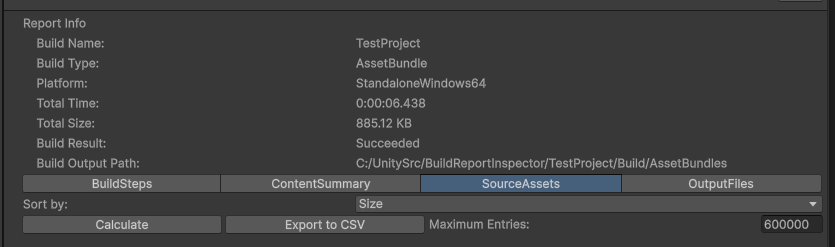
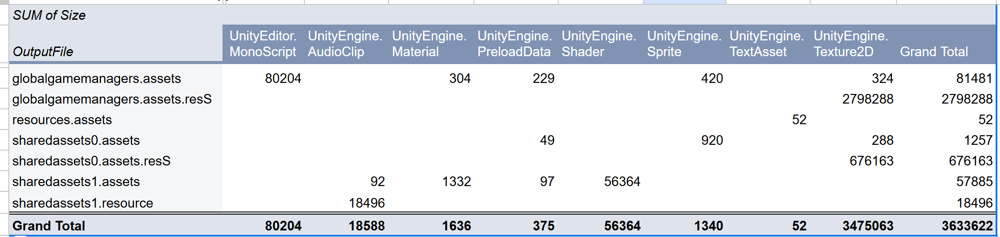
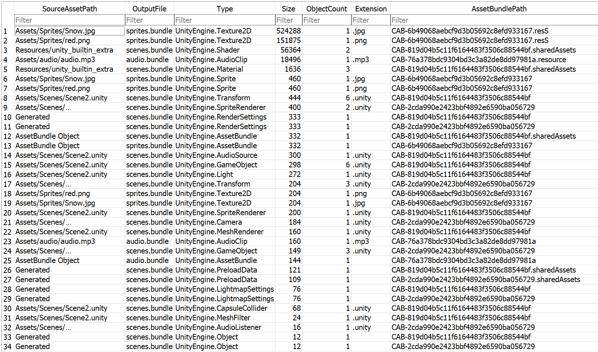

# Exporting and Analysis from the BuildReport

## Source Assets CSV Export

For large builds the PackedAsset data can become too large to show at a high level of detail in the user interface.  The PackedAssets reports every single object, which can grow to hundreds of thousands of entries.  The overall size of the data can be quite large even when we collapse all objects of the same type, from the same asset, down to a single "content entry".

Also the Source Assets tab offers only a few different ways to combine and sort data.  It doesn't offer the ability to filter or group the data in other ways.  For example "finding all content from all prefab files" or grouping things in a way that makes sense with the structure of your project.

To analysis the data in different ways the BuildReportInspector has a button on the SourceAssets tab that lets you can export all the SourceAssets data to CSV format.  This is a simple "comma separated value" file, which is a data interchange format that is widely understood by other software.  This will write a file in the same location and name as the BuildReport, but ending with "_SourceAssets.csv".



For reasonably large outputs you can load the results into a spreadsheet, then use spreadsheet features like filtering, graphing or pivot tables to analyze the data.

This is a simple example of analysis of the output from the TestProject, using a pivot table with rows set to OutputFile, Columns set to Type and Values set to Sum of Size.



For very large outputs, a database could be a better place to put the data.  Databases can easily handle millions of entries.  For example `SQLite` is a widely used and freely available database that can be downloaded and run locally from the command line, or with a SQLite GUI utility.



This is an example script for converting the cvs file output from the Source Assets tab into a SQLite database: [source_asset_to_sqlite.ps1](./source_asset_to_sqlite.ps1)

Once the data is in SQLite you can perform queries, for example this query will count how many Unity objects were built from prefab files.

```
sqlite3 MyDB.db "SELECT SUM(ObjectCount) AS TotalPrefabObjectCount FROM ContentEntry WHERE SourceAssetPath LIKE '%.prefab';"
```

### Other examples

The CSV export and example usage described above are just an illustration of some of the potential for doing custom build analysis, using widely available tools.  Hopefully these examples inspire you to take things further based on your own ideas and requirements.

If the SourceAsset csv data is not suitable for your needs, then the BuildReport API and other parts of the Unity API can be used to extract other data.  

The SourceAsset data could potentially be combined and cross referenced with data output by the [Analyse feature of UnityDataTools](https://github.com/Unity-Technologies/UnityDataTools/blob/main/UnityDataTool/README.md#analyzeanalyse).  You might also mix in information about the dependencies between the Source Assets.  Or use the [dependency](https://docs.unity3d.com/Documentation/ScriptReference/AssetBundleManifest.GetAllDependencies.html) relationship of AssetBundles.  In the case of AssetBundles, the Source Asset data could also help find data that is duplicated in more than one AssetBundle.

Another possible direction would be to import the SourceAsset data from multiple builds into the same database, and then run queries to compare the builds and pinpoint the differences.

Tip: For even faster export speed it might work well to write a Unity script that imports the data directly into a database, instead of using an intermediate CSV file.

