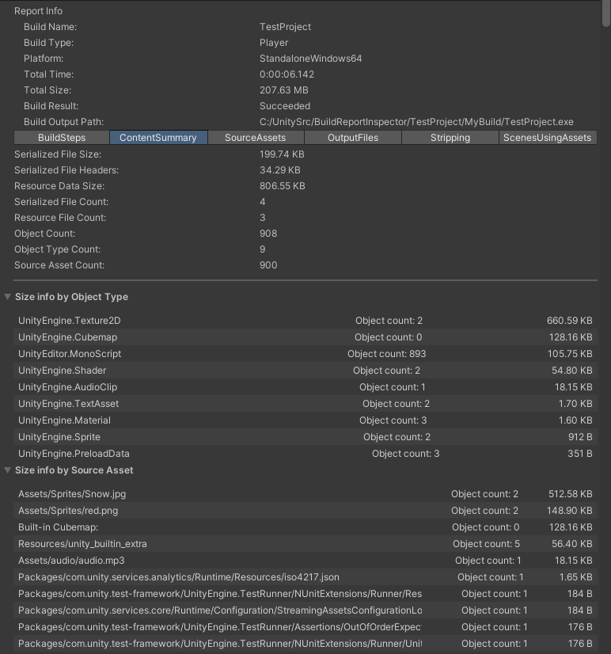

# Content Summary Tab

A summary of the content of the build, including some overall statistics and then sizes and object counts aggregated by Type and Source Asset.

Note: **The sizes reported are prior to any compression**.  If you build AssetBundles with compression, or use the BuildOptions.CompressWithLz4HC flag for a Player build, then the size on disk can be smaller than what is reported on this tab.  Even when compression is not used, extra padding bytes between objects and resource blobs can mean that the actual size of disk is different from the sum of the sizes of the individual objects.

This information is calculated from the same PackedAsset information from the BuildReport that is used to populate the SourceAssets tab. But this page focuses on summarizing key information.

The data shown in this view is only calculated on-demand, because the PackedAsset information can grow very large for large builds.

Here is another example, from a much larger build:

The following section explains some details about what each statistic means:

**Serialized File Size** - This is the sum of the size of all the Serialized Files in the build output.  Serialized Files refers the binary file format that Unity users to store Unity Objects.  In the build output this is the format used for scenes (e.g. level files) and sharedAssets.  AssetBundles also include Serialized Files, which have a name like CAB-<hash> and no file extension.  

**Serialized File Headers** - This is the sum of the header sections of all the Serialized Files.  The header is extra information at the start of the file, prior to the actual serialized Objects.  The size of this data relative to the total serialized file size is something to keep an eye on, especially if you split your Player content into many scenes, or your AssetBundle into many AssetBundles.  In some cases it can become a significant overhead.  The header is where TypeTrees are stored.  By default TypeTrees are excluded from Player builds, but they are included in AssetBundles unless you specify the flag  [BuildAssetBundleOptions.DisableWriteTypeTree](https://docs.unity3d.com/ScriptReference/BuildAssetBundleOptions.DisableWriteTypeTree.html).

**Resource File Count** - "Resource" is rather an overloaded term in Unity.  But in this context it is the count of all .resS or .resource files in the build output.  There are companion files to the Serialized Files, containing Texture, Mesh, Audio and Video data as blobs.  These files do not have a header.

**Object Count** - This is the count of all objects in the build output.  Note: This does not include objects inside Scene files (because they are not currently included in the PackedAsset output).

**Object Type Count** - This is the count of different Unity Object types in the build output.  See [Unity Object Types](https://docs.unity3d.com/Manual/ClassIDReference.html) for a list of all the different types.  Note: this count does not include different Scripting Types (e.g. different classes derived from MonoBehaviour or ScriptableObject).  All such objects in the build output are classified as "MonoBehaviour".  

**Source Asset Count** - This is the total number of Assets in the project that contributed objects to the build output.  

At the bottom of the tab there are foldouts that show the total list of different types and the list of source assets.  For each element the total size is shown - this is the sum of the size of the objects and resource blobs (.resS or .resource content) attributed to that Type or Source Asset.  

Note: in the case of AssetBundles the objects from a source asset can get duplicated into multiple bundles.  This will result in a larger size in the build output.  So studying the size information recorded on this tab can be useful to get a sense of the impact of any duplication, especially for larger Assets.
