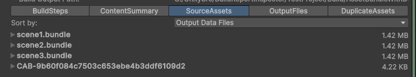
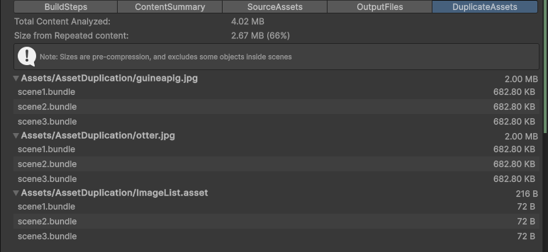
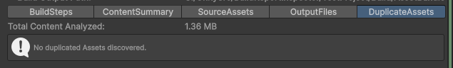
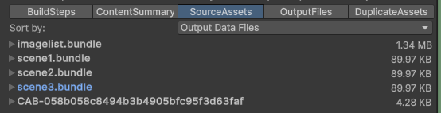

# Duplicated Assets Tab

This tab is only shown for AssetBundle builds (because Player builds automatically avoid duplicating content).

With AssetBundles the layout of Assets into bundles is up to the users control.  In practice it is quite easy to accidentally duplicate data because assets that are not explicitly assigned to a bundle can be copied inside multiple bundled, if those assets are referenced from multiple bundles.

This tab reports the overall size and percentage of duplication, and makes it possible to see the worst offenders (by overall size).  Solving duplication is typically a question of adding additional AssetBundles with the Assets that are listed, or rearranging Assets between AssetBundles, so that they can share content inside the same AssetBundle.

This screen shot shows an example for a simple scenario that is included in the TestProject.  You can try it out yourself, but here is a quick summary.

There are three scenes that all reference the same ImageList.asset.  The ImageList.asset in turn references two textures.

When the scenes are each assigned to their own AssetBundle the ImageList and textures are repeated 3 times in the output build.

When viewing the output in the Source Assets tab it may not be immediate evident that something is wrong:

But the Duplicate Asset tab reports that the same Assets are appearing in more than one AssetBundle.

In this case the duplication can fully resolved, by assigning the ImageList.asset to its own bundle.  This automatically solves the problem of the repeated Textures because they are only referenced from that asset.

The details of the new layout can be viewed on the Source Assets tab:

Note: Another way to resolve the duplicates in this case is to put all three scenes into the same AssetBundle.

Note: sometimes some degree of duplication is desirable in AssetBundles. For small Assets that are not used universally then some degree of repeats can be more efficient than having many tiny AssetBundles.  It can also be a way to avoid dependencies between AssetBundles, when working on optimizing distribution and download patterns.
