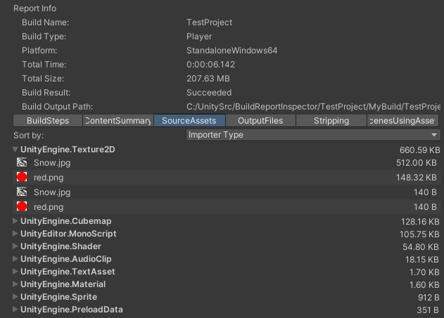
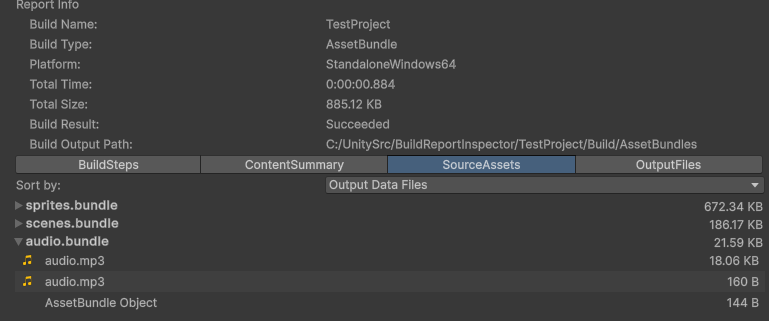

# Source Assets Tab

This page displays information about the objects and resources (audio clips, meshes and textures) and how they contribute to the build size.   It shows details than the Content Summary tab.

Warning: Objects inside Scene files are currently not reported in the BuildReport (e.g. no PackedAssets are generated for level files).

There are three available views:

**Size** shows the objects grouped by their source asset and Type.  If you hover over the entry the number of objects of the type inside the Asset is shown.  Note: The same Asset can show up multiple times, because may contain multiple types of objects.  And in the case of a Texture there will be an entry for the Texture object and another for the texture data (from the .resS file).

**Output Data Files** This show information about the content of the output files, based on the source asset and type.  Hover over the entry to see the number of objects (or resources).

**Importer Type** This shows information about grouped by object type.  This is useful to see the size of all objects and resources of a particular type, and which Assets contributed them.

For the API equivalent see [PackedAssets](https://docs.unity3d.com/6000.1/Documentation/ScriptReference/Build.Reporting.PackedAssets.html).

In the case of AssetBundle builds the AssetBundle name is shown instead of the internal archive filename when you sort by Output Data File.

Warning: This view aggregates information about every single object in the build.  Currently this view is so slow that it is unusable for large builds (e.g. large numbers of Assets or prefabs with large GameObject hierarchies).

**Export to CSV**

See [Exporting and Analysis](./exporting-and-analysis.md) for more details.
